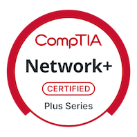
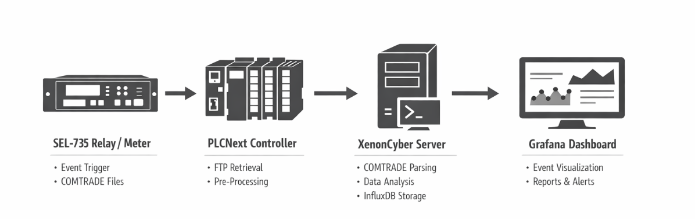

  

<h1 align="center">Emmanuel Chibwe 🥸</h1>

Network and Security Specialist | Software Developer  
I'm a currently working torwards creating SAAS' and API's while studying for my aws and security+ certs. I'm very keen on working in the cybersecurity industry 
but also interested in seeing how far my creativity can go with all the other languages and tool at my disposal as a software developer
  
All of my repositories are part of my continuous learning journey, showcasing the practical skills and technologies I am actively developing.  
I am CompTIA Network+ certified and continuously expanding my expertise in networking, cloud systems, and secure application design.  
  
I am open to collaborating on impactful projects, especially those involving networking, distributed systems, or security-focused applications.

  

---

### 🔐 Network+ Skills

##

### 🧰 Languages and Tools

---

<h1 align="center">Currently Working On</h1>

  

### ⚡ Transient Power Disturbance Processing & Visualization (XCAP)

Working on an industry project with **XenonCyber Dynamics** to build an end-to-end pipeline for processing and visualizing COMTRADE power disturbance data.

The system captures events from SEL relays, transfers them through a PLCNext controller, processes and analyzes them on a server using Python, stores results in InfluxDB, and visualizes them in Grafana dashboards.

##

### 📈 Progress

- End-to-end pipeline operational  
- Automated ingestion and deduplication  
- Dockerized services for deployment  
- Live Grafana dashboards for event visualization  

##

### 🔄 Workflow

  

##

### 📊 Grafana

Grafana dashboards display processed COMTRADE data as interactive visualizations, including three-phase voltage waveforms, current waveforms, and system frequency trends. Events can be selected dynamically, allowing detailed inspection of each disturbance.

  

##

### Future Work

- Performance and reliability improvements  
- Dashboard enhancements  
- Alerting and reporting features  

---

### Learn More About XenonCyber

XenonCyber Dynamics is a Canadian company specializing in operational technology, cybersecurity, and resilient energy systems.
Click the link below to learn more about them

https://xenoncyber.ca/
